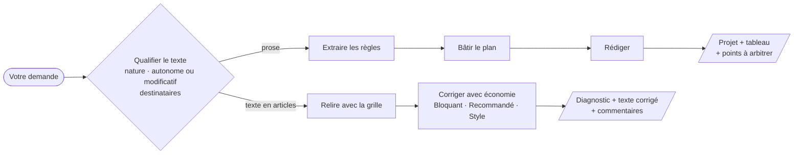

<div align="center">

# ⚖️ legistique-fr

**Une skill pour agents IA qui rédige et corrige les textes normatifs français**<br>
loi · ordonnance · décret · arrêté · article de code

[](https://github.com/kilianvivien/skill-legistique-fr/releases/latest)
[](LICENSE)
[](https://agentskills.io)
[](#-installation)
[](https://www.legifrance.gouv.fr/contenu/menu/autour-de-la-loi/guide-de-legistique)

[Installation](#-installation) · [Utilisation](#-utilisation) · [Exemples](#-exemples) · [Fonctionnement](#-comment-ça-marche) · [Limites](#-limites-et-garde-fous)

</div>

---

## En bref

`legistique-fr` apprend à un agent IA les règles d'écriture du **Guide de légistique** (Conseil d'Etat
et secrétariat général du Gouvernement, 4e édition mise à jour en 2026). La skill fait deux choses :

<table>
<tr>
<td width="50%" valign="top">

### ✍️ A. Rédiger

Vous donnez **une note, une idée de réforme, une mesure en langage courant**.

Vous recevez **un projet de texte en articles**, présenté comme au Journal officiel, accompagné d'un
**tableau qui explique chaque transformation** et de la liste des **points à arbitrer**.

</td>
<td width="50%" valign="top">

### 🔍 B. Corriger

Vous donnez **un projet de loi, de décret, d'arrêté ou un amendement** déjà rédigé.

Vous recevez **un diagnostic, le texte corrigé en entier** et **un tableau de commentaires
numérotés**, classés *Bloquant*, *Recommandé* ou *Style*, avec le renvoi à la fiche du guide.

</td>
</tr>
</table>

> [!NOTE]
> Chaque correction cite sa source (« fiche 3.3.1 », « fiche 3.5.3 ») : vous pouvez vérifier dans le
> guide et apprendre la règle au passage.

> [!IMPORTANT]
> **Pas seulement pour Claude.** La skill suit le standard ouvert [Agent Skills](https://agentskills.io) :
> un dossier avec un fichier `SKILL.md` et des fiches de référence en Markdown, sans code ni
> dépendance. Elle fonctionne avec tous les agents compatibles : Claude, Codex (OpenAI), Mistral Vibe,
> Cursor, Gemini CLI, GitHub Copilot, OpenCode, Goose, Junie et
> [bien d'autres](https://agentskills.io/clients).

---

## 📦 Installation

Téléchargez **`legistique-fr.zip`** depuis la
[dernière release](https://github.com/kilianvivien/skill-legistique-fr/releases/latest). L'archive
contient le dossier de la skill et un `README.md` d'installation.

Installer la skill, c'est **copier le dossier `legistique-fr/` dans le dossier de skills de votre
agent**. Le résultat attendu est toujours le même : `<dossier de skills>/legistique-fr/SKILL.md`.

| Agent | Pour tous vos projets | Pour un seul projet |
|---|---|---|
| **Codex** (OpenAI) | `~/.agents/skills/` | `.agents/skills/` |
| **Mistral Vibe** | `~/.vibe/skills/` ou `~/.agents/skills/` | `.vibe/skills/` ou `.agents/skills/` |
| **Claude Code** | `~/.claude/skills/` | `.claude/skills/` |
| **Cursor** | `~/.cursor/skills/` ou `~/.agents/skills/` | `.cursor/skills/` ou `.agents/skills/` |
| **Gemini CLI** | `~/.gemini/skills/` ou `~/.agents/skills/` | `.gemini/skills/` ou `.agents/skills/` |
| **GitHub Copilot** | `~/.copilot/skills/` ou `~/.agents/skills/` | `.github/skills/` ou `.agents/skills/` |
| **Claude.ai** | import de l'archive dans les paramètres | — |

> [!TIP]
> **`~/.agents/skills/` est le dossier commun** du standard : une seule installation y sert à la fois
> Codex, Mistral Vibe, Cursor, Gemini CLI et GitHub Copilot.

<details open>
<summary><b>Codex (OpenAI)</b></summary>

<br>

Pour tous vos projets :

```bash
mkdir -p ~/.agents/skills
```

```bash
unzip legistique-fr.zip 'legistique-fr/*' -d ~/.agents/skills/
```

Pour un seul projet, depuis la racine du dépôt :

```bash
mkdir -p .agents/skills
```

```bash
unzip legistique-fr.zip 'legistique-fr/*' -d .agents/skills/
```

Redémarrez Codex. La skill se déclenche d'elle-même ; pour l'appeler explicitement, tapez
`$legistique-fr` dans votre message ou listez les skills avec `/skills`.
([Documentation Codex](https://developers.openai.com/codex/skills/))

</details>

<details open>
<summary><b>Mistral Vibe</b></summary>

<br>

Pour tous vos projets :

```bash
mkdir -p ~/.vibe/skills
```

```bash
unzip legistique-fr.zip 'legistique-fr/*' -d ~/.vibe/skills/
```

Pour un seul projet, depuis sa racine :

```bash
mkdir -p .vibe/skills
```

```bash
unzip legistique-fr.zip 'legistique-fr/*' -d .vibe/skills/
```

> [!NOTE]
> Vibe ne charge les skills d'un projet (`.vibe/skills/` ou `.agents/skills/`) que si le dossier du
> projet est marqué comme **dossier de confiance**. Les skills globales n'ont pas cette contrainte.

Relancez `vibe` : la skill se déclenche dès que votre demande porte sur un texte normatif.
([Documentation Mistral Vibe](https://github.com/mistralai/mistral-vibe#skills-system))

</details>

<details>
<summary><b>Claude Code</b></summary>

<br>

Pour tous vos projets :

```bash
mkdir -p ~/.claude/skills
```

```bash
unzip legistique-fr.zip 'legistique-fr/*' -d ~/.claude/skills/
```

Pour un seul projet, remplacez `~/.claude/skills/` par `.claude/skills/`. Redémarrez Claude Code ; la
skill peut aussi être appelée avec `/legistique-fr`.

</details>

<details>
<summary><b>Claude.ai et application Claude (web, bureau)</b></summary>

<br>

1. **Paramètres → Capacités** : vérifiez que l'exécution de code est activée.
2. Rubrique **Skills** → **Importer une skill** → sélectionnez `legistique-fr.zip`.
3. Activez `legistique-fr` dans la liste.

> [!TIP]
> Si l'import refuse l'archive, décompressez-la puis compressez **seulement le dossier
> `legistique-fr/`** et importez ce nouveau fichier.

</details>

<details>
<summary><b>Autres agents (Cursor, Gemini CLI, GitHub Copilot, OpenCode…)</b></summary>

<br>

Décompressez le dossier dans le dossier de skills indiqué par la documentation de votre agent (voir le
tableau ci-dessus, ou la [liste des agents compatibles](https://agentskills.io/clients)). Dans le doute,
`~/.agents/skills/` est reconnu par la plupart d'entre eux.

</details>

<details>
<summary><b>Sans l'archive, depuis ce dépôt</b></summary>

<br>

```bash
git clone https://github.com/kilianvivien/skill-legistique-fr.git
```

Puis copiez `skill-legistique-fr/legistique-fr/` dans le dossier de skills de votre agent, par exemple :

```bash
cp -R skill-legistique-fr/legistique-fr ~/.agents/skills/
```

</details>

---

## 🚀 Utilisation

**Pas de commande à retenir.** La skill se déclenche dès que vous demandez de rédiger, relire,
corriger ou « mettre en forme juridique » un texte normatif, même sans prononcer le mot
« légistique ». Pour l'appeler explicitement : `$legistique-fr` dans Codex, `/legistique-fr` dans
Claude Code ou Cursor.

### Ce que vous pouvez demander

| Vous écrivez… | La skill… |
|---|---|
| « Voici la note du cabinet, fais-en un projet de décret : … » | **rédige** (fonction A) |
| « Rédige-moi un amendement qui insère un article après l'article L. 731-1 du code de l'éducation » | **rédige** un article modificatif |
| « Relis ce projet d'arrêté et dis-moi ce qui ne va pas : … » | **corrige** (fonction B) |
| « Réécris proprement ce décret » | **corrige**, puis **rédige** les parties à reprendre |
| « Dans quel ordre mettre les visas ? » · « Comment abroger un alinéa ? » | **répond** directement |

### Pour de meilleurs résultats

1. **Précisez la nature du texte** (loi, décret en Conseil d'Etat, arrêté…). Sinon, la skill la
   déduit de la matière et l'annonce en tête de réponse.
2. **Fournissez le texte modifié en vigueur** quand vous modifiez un texte existant : c'est la seule
   façon de vérifier les désignations d'alinéas.
3. **Donnez les dates et consultations** connues (avis, Conseil d'Etat, ministres rapporteurs).
4. **Lisez les « Points à arbitrer »** : la skill ne tranche jamais un choix de fond (seuil, montant,
   autorité compétente, sanction) à votre place.

### Ce que vous recevez

<table>
<tr>
<th>Fonction A : rédaction</th>
<th>Fonction B : correction</th>
</tr>
<tr>
<td valign="top">

1. **Hypothèses retenues**
2. **Projet de texte**
3. **Tableau des transformations**
4. **Points à arbitrer**
5. **Contenu écarté du dispositif** (et proposition de notice)

</td>
<td valign="top">

1. **Diagnostic** (les points bloquants d'abord)
2. **Texte corrigé** en entier
3. **Commentaires** numérotés avec niveau et fiche
4. **Questions au rédacteur**

</td>
</tr>
</table>

---

## 📚 Exemples

Trois sorties complètes, produites par la skill, sont disponibles dans [`exemples/`](exemples/).

### Rédaction : d'une note de cabinet à un projet de décret

> *« On veut que toutes les entreprises de plus de 50 salariés qui utilisent des véhicules de fonction
> publient chaque année un bilan de leurs émissions […]. Le bilan devra impérativement être transmis à
> l'ADEME avant le 31 mars et/ou mis en ligne sur leur site. Les entreprises qui ne le font pas
> pourront être sanctionnées. Un arrêté précisera les modalités d'application. »*

Extrait du tableau des transformations :

| Passage de la prose | Devenu | Règle appliquée |
|---|---|---|
| « devra impérativement être transmis » | « transmet … au plus tard le 31 mars » | Ni futur, ni « devra », ni « impérativement » (3.3.1) |
| « à l'ADEME » | « à l'Agence de l'environnement et de la maîtrise de l'énergie » | Sigles proscrits (3.3.1) |
| « avant le 31 mars » | « au plus tard le 31 mars de l'année qui suit » | Délais sans ambiguïté : « avant » exclut le 31 (3.3.1) |
| « et/ou mis en ligne » | double obligation : publie **et** transmet | « et/ou » proscrit, choix signalé à arbitrer (3.3.1) |
| « Un arrêté précisera les modalités d'application » | l'arrêté fixe le modèle, la méthode de calcul et les modalités de transmission | Subdélégation encadrée (3.5.3) |

➡️ [Voir la sortie complète](exemples/1-prose-vers-decret.md)

### Correction : relecture d'un décret modificatif

Extrait du tableau de commentaires :

| N° | Emplacement | Constat | Niveau |
|---|---|---|---|
| 2 | Visas | La Constitution est visée en dernier, le code après le décret | 🟠 Recommandé |
| 6 | Têtes d'article | « Article 1 » au lieu de « Article 1er » | ⚪ Style |
| 7 | Art. 1er et 3 | L'article 3 du décret de 2015 est modifié deux fois, la seconde modification vise un 3° qui n'existe plus | 🔴 Bloquant |

➡️ [Voir la sortie complète](exemples/2-correction-decret.md)

### Question pointue : étendre un décret à Wallis-et-Futuna

> *« Je prépare un décret en Conseil d'Etat qui modifie plusieurs articles réglementaires du code de
> l'environnement. Le ministère veut que ces modifications s'appliquent aussi à Wallis-et-Futuna.
> Comment dois-je rédiger ça ? »*

Les fiches de synthèse ne traitent pas de l'outre-mer : la skill consulte le guide complet (fiches
3.6.1, 3.6.2 et 3.6.9, lues par section). Elle écarte la mention « le présent décret est applicable à
Wallis-et-Futuna » au profit d'un « compteur Lifou » inscrit dans le code, propose l'article pour les
trois situations possibles du code, et signale en premier point à arbitrer que plusieurs matières
environnementales relèvent de la compétence de la collectivité.

➡️ [Voir la sortie complète](exemples/3-extension-wallis-et-futuna.md)

---

## 🧠 Comment ça marche



La skill suit la méthode du guide : **on qualifie d'abord le texte**, car presque toutes les règles en
dépendent. Une loi n'a ni visas ni article d'exécution. Les assemblées écrivent « est ainsi rédigé »
là où le règlement écrit « est remplacé par les dispositions suivantes ».

L'agent ne charge pas tout le guide d'un coup. Il lit la fiche de référence utile au moment utile :

| Fichier | Contenu |
|---|---|
| [`SKILL.md`](legistique-fr/SKILL.md) | Méthode, choix de la fonction, formats de sortie, garde-fous |
| [`structure-et-plan.md`](legistique-fr/references/structure-et-plan.md) | Plans, divisions, articles, alinéas, énumérations, numérotation |
| [`langue-et-style.md`](legistique-fr/references/langue-et-style.md) | Temps, vocabulaire précis, mots proscrits, renvois, désignation des autorités |
| [`modifications-insertions.md`](legistique-fr/references/modifications-insertions.md) | Formules de modification, d'insertion, d'abrogation ; « susvisé » |
| [`formules-et-modeles.md`](legistique-fr/references/formules-et-modeles.md) | Squelettes de loi, ordonnance, décret, arrêté ; visas ; entrée en vigueur ; notice |
| [`typographie.md`](legistique-fr/references/typographie.md) | Règles typographiques du Journal officiel |
| [`grille-de-relecture.md`](legistique-fr/references/grille-de-relecture.md) | Liste de contrôle ordonnée, avec niveaux de gravité |
| [`guide/`](legistique-fr/references/guide/index.md) | **Texte intégral du guide**, une fiche par fichier, avec un index : source subsidiaire |

Ces fiches de synthèse suffisent dans la plupart des cas. Pour un point qu'elles ne couvrent pas
(procédure d'élaboration, outre-mer, lois de finances, nominations, cas pratiques de la partie 5…),
l'agent consulte le guide complet : il repère la fiche dans l'index, n'en lit que la section utile et
la cite.

---

## 🛡️ Limites et garde-fous

La skill est un **assistant de rédaction**, pas un substitut à l'expertise d'un légiste ni à l'examen
du Conseil d'Etat. Elle est réglée pour **signaler plutôt qu'inventer** :

- ❌ Pas de numéro d'article de code inventé : elle écrit « l'article L. … » et le signale.
- ❌ Pas de numéro NOR, de numéro de décret, de date de signature ni de nom de ministre fabriqués.
- ❌ Pas de choix de fond tranché à votre place : les propositions sont entre crochets et listées.
- ⚠️ Pas d'accès au droit en vigueur : vérifiez toujours les textes cités sur
  [Légifrance](https://www.legifrance.gouv.fr).

> [!WARNING]
> Relisez toujours le résultat. Un texte normatif engage ceux qui l'appliquent.

---

## 🗂️ Structure du dépôt

```
skill-legistique-fr/
├── legistique-fr/            la skill
│   ├── SKILL.md
│   ├── references/           fiches thématiques chargées à la demande
│   │   └── guide/            texte intégral du guide (101 fiches + index)
│   └── evals/evals.json      cas de test
├── exemples/                 sorties complètes produites par la skill
├── distribution/README.md    README d'installation inclus dans l'archive
└── scripts/
    ├── build-zip.sh          construit legistique-fr.zip
    └── convert-guide.py      régénère references/guide/ depuis le PDF du guide
```

## 🤝 Contribuer

Les retours de légistes et de rédacteurs sont les bienvenus : ouvrez une
[issue](https://github.com/kilianvivien/skill-legistique-fr/issues) avec le texte soumis, la réponse
obtenue et la règle qui n'a pas été respectée (avec la fiche du guide si possible).

Pour reconstruire l'archive après une modification :

```bash
./scripts/build-zip.sh
```

À chaque nouvelle version du guide, téléchargez le PDF depuis
[Légifrance](https://www.legifrance.gouv.fr/contenu/menu/autour-de-la-loi/guide-de-legistique) dans
`Source/guide_legistique_2026.pdf` (ou passez son chemin en argument), puis régénérez les fiches.
Le script demande Python 3.9 ou plus et [PyMuPDF](https://pypi.org/project/PyMuPDF/) :

```bash
pip install pymupdf
```

```bash
python3 scripts/convert-guide.py
```

Relisez ensuite les fiches à tableaux (1.3.2, 2.1.4, 3.6.1, 4.1.3, 4.2.4) et l'annexe typographique.

## 📖 Sources

- [*Guide de légistique*](https://www.legifrance.gouv.fr/contenu/menu/autour-de-la-loi/guide-de-legistique), Conseil d'Etat et secrétariat général du Gouvernement, 4e édition, mise à
  jour 2026.
- Un cours de légistique reprenant l'essentiel du guide.

Les fichiers PDF sources ne sont pas redistribués dans ce dépôt. Le texte du guide est repris sous
forme Markdown dans `legistique-fr/references/guide/` (voir ci-dessous).

## Licence

Copyright 2026 Kilian Vivien — distribué sous licence [MIT](LICENSE).

La licence couvre uniquement le contenu original de ce dépôt : la skill, ses fiches de synthèse, les
exemples, les scripts et la documentation.

Elle ne couvre pas le dossier `legistique-fr/references/guide/`. Ce dossier reproduit le texte du
*Guide de légistique* (Conseil d'Etat et secrétariat général du Gouvernement, 4e édition, mise à jour
2026), converti automatiquement depuis le PDF publié sur Légifrance, dont les contenus sont diffusés
sous [licence etalab-2.0](https://www.etalab.gouv.fr/licence-ouverte-open-licence/) sauf mention
contraire. La conversion peut comporter des erreurs, notamment dans les tableaux : seule la version
publiée sur Légifrance fait foi.

Le cours de légistique ayant servi de source n'est pas redistribué ; ses règles sont reformulées et
citées à titre de référence.
